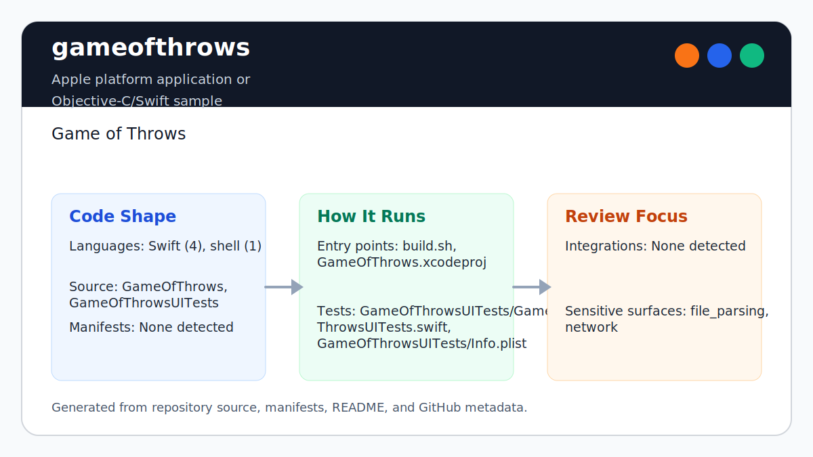

# gameofthrows

<!-- README-OVERVIEW-IMAGE -->


## Overview

`garethpaul/gameofthrows` is an Apple platform application or Objective-C/Swift sample. Game of Throws

This README is based on the checked-in source, manifests, scripts, and repository metadata on the `master` branch. The project language mix found during review was: Swift (4), shell (1).

## Repository Contents

- `README.md` - project overview and local usage notes
- `build.sh`
- `CHANGES.md` - concise history of maintenance changes
- `GameOfThrows` - source or example code
- `GameOfThrows.xcodeproj` - Xcode project file
- `GameOfThrowsUITests` - source or example code
- `Makefile` - local verification entry point
- `SECURITY.md` - security reporting and disclosure guidance
- `scripts/check-baseline.sh` - static SpriteKit/Xcode project checks
- `VISION.md` - project direction and maintenance guardrails

Additional scan context:

- Source directories: GameOfThrows, GameOfThrowsUITests
- Dependency and build manifests: none detected
- Entry points or build surfaces: build.sh, Makefile, GameOfThrows.xcodeproj
- Test-looking files: GameOfThrowsUITests/GameOfThrowsUITests.swift, GameOfThrowsUITests/Info.plist

## Getting Started

### Prerequisites

- Git
- macOS with Xcode for building Apple platform projects

### Setup

```bash
git clone https://github.com/garethpaul/gameofthrows.git
cd gameofthrows
```

The setup commands above are derived from repository files. Legacy mobile, Python, or JavaScript samples may require older SDKs or package versions than a modern workstation uses by default.

## Running or Using the Project

- Open `GameOfThrows.xcodeproj` in Xcode, choose the app or sample scheme, and run it on the matching simulator/device.
- Run `./build.sh` when the required platform toolchain is installed.

## Testing and Verification

- Run `make lint`, `make test`, `make build`, and `make check` for static
  project, script, asset, and crash-hardening checks that do not require Xcode.
  The `lint`, `test`, and `build` targets currently delegate to the static
  baseline.
- Use the absolute Makefile path to run the same gates from another working
  directory. Verification resolves the checker relative to the loaded
  Makefile rather than the caller's directory.
- The static baseline also preserves the score sensor contract: each pipe score
  zone removes itself after the first contact so a single pass cannot count
  twice.
- Score increments are limited to bird-score contacts, so future physics
  category changes cannot accidentally award points for non-player contacts.
- For game-over handling, only explicit bird-world or bird-pipe contacts end a run;
  unrelated physics contacts are ignored.
- Touch handling applies one bird impulse per touch event and guards missing
  bird physics before flapping.
- Restart resets the score label scale as well as the score value so prior
  scoring animations do not carry into a new run.
- Restart checks required scene resources before moving the bird, clearing
  pipes, or resetting labels.
- The pipe spawning loop is guarded so stopped gameplay or incomplete scene
  setup cannot add new pipe pairs.
- Touch, contact, and pipe spawning paths share an active-gameplay guard before
  reading movement state.
- Contact handling guards required scene resources before score or collision
  work and avoids delayed `self.bird` access after a crash contact.
- The repeating spawn action uses a weak scene capture and is removed with
  pending flash work when the scene leaves its SpriteKit view.
- View teardown stops the moving graph first, making the shared
  active-gameplay guard reject late frame, touch, contact, or spawn work before
  scene actions and contact ownership are released.
- Scene presentation clears prior keyed actions and child nodes before rebuilding gameplay,
  preventing duplicate physics and rendering graphs when a scene is presented again.
- Presentation reset and view teardown cancel the bird's keyed death rotation before releasing child or delegate ownership.
- Restart cancels the keyed death rotation before restoring bird state, so a
  prior collision cannot stop animation in the new run.
- Per-frame flight orientation stops with active gameplay so it cannot
  overwrite the keyed death rotation after a fatal collision.
- Shared schemes may reference only targets present in `project.pbxproj`; the
  app scheme runs the existing UI launch test without the removed unit-test
  bundle.
- Xcode's test action or `xcodebuild test` with the appropriate scheme and destination
- Run `./build.sh` on macOS with Xcode installed. Set `IOS_SIMULATOR_NAME` to
  override only the simulator name, or `IOS_DESTINATION` to provide a full
  xcodebuild destination string.
- GitHub Actions runs `make check` on macOS with read-only permissions, an
  immutable checkout action, and `persist-credentials: false`. It parses the
  Xcode project without selecting an obsolete simulator. Run `build.sh`
  explicitly for UI testing.

When the required SDK or runtime is unavailable, use static checks and source review first, then verify on a machine that has the matching platform toolchain.

## Configuration and Secrets

- No required secret or credential file was identified in the repository scan. If you add integrations later, keep secrets out of git.

## Security and Privacy Notes

- Review changes touching network requests, sockets, or service endpoints; examples from the scan include GameOfThrows/Info.plist, GameOfThrowsUITests/Info.plist.
- Review changes touching file, media, JSON, XML, CSV, OCR, or data parsing; examples from the scan include GameOfThrows/Info.plist, GameOfThrowsUITests/Info.plist.

## Maintenance Notes

- See `docs/plans/2026-06-10-hosted-project-validation.md` for the hosted Xcode
  project parsing boundary.
- See `docs/plans/2026-06-12-ci-policy-hardening.md` for the canonical hosted
  workflow and hostile-mutation boundary.
- See `docs/plans/2026-06-12-shared-scheme-target-integrity.md` for shared
  scheme target validation.
- This looks like an Apple platform project or sample. Xcode, Swift, CocoaPods, and deployment target versions may need to match the original project era.
- Run `make lint`, `make test`, `make build`, and `make check` before pushing
  changes that touch SpriteKit scene loading, assets, build scripts, project
  files, or UI test setup.
- See `SECURITY.md` for vulnerability reporting and safe research guidance.
- See `VISION.md` for project direction and contribution guardrails.
- See `docs/plans/2026-06-09-single-tap-impulse-guard.md` for the tap impulse
  guard.
- See `docs/plans/2026-06-09-score-label-restart-reset.md` for the score label
  restart reset.
- See `docs/plans/2026-06-09-restart-resource-guard.md` for the restart scene
  resource guard.
- See `docs/plans/2026-06-09-contact-resource-guard.md` for the contact scene
  resource guard.
- See `docs/plans/2026-06-09-score-contact-bird-pairing.md` for the explicit
  score-contact pairing guard.
- See `docs/plans/2026-06-09-pipe-spawn-readiness-guard.md` for the pipe
  spawning readiness guard.
- See `docs/plans/2026-06-09-gameofthrows-make-gate-aliases.md` for local
  verification target guardrails.
- See `docs/plans/2026-06-09-gameplay-state-guard.md` for the shared
  active-gameplay guard.
- See `docs/plans/2026-06-10-scene-action-lifecycle.md` for repeating action
  ownership and scene teardown.

## Contributing

Keep changes small and tied to the project that is already present in this repository. For code changes, document the toolchain used, avoid committing generated dependency directories or local configuration, and update this README when setup or verification steps change.
